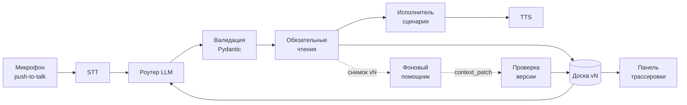

# Voice Router

Голосовой роутер сценариев для вымышленной страховой компании **Saqta Insurance**.
HackAlem AI, трек Halyk Bank, кейс 2.

> **Статус: в разработке.** Сейчас в репозитории каркас: backend, frontend и БД поднимаются одной командой. Разделы ниже, помеченные *(план)*, описывают целевое поведение по [спеке](docs/specs/voice-router-spec.md) и будут обновляться по ходу работы.

## Что делает

Клиент нажимает кнопку и говорит на русском, казахском или вперемешку. Система:

1. распознаёт речь (STT);
2. **LLM-роутер** выбирает сценарий из всех 40 сценариев кита (+ `SYS_OUT_OF_SCOPE`, `SYS_UNCLEAR`, `SYS_GOODBYE`), определяет язык и извлекает параметры;
3. исполнитель сценария собирает недостающие параметры, читает данные клиента и базу знаний, при необходимости просит подтверждение или передаёт звонок оператору с контекстом;
4. отвечает голосом (TTS) на языке клиента;
5. **панель трассировки** показывает транскрипт, выбранный сценарий, обоснование, альтернативы с уверенностью, слоты, факты с источниками и время по этапам.

Слой выбора сценария — это LLM на общей рабочей памяти диалога (blackboard), а не intent-классификатор.

## Архитектура *(план)*



- **Доска** — append-only журнал диалога в Postgres (JSONB). Роутер читает из неё, панель её рендерит.
- **Роутер** — один LLM-вызов с карточками всех сценариев, строгий JSON-ответ с валидацией.
- **Исполнитель** — один автомат на все сценарии, сценарий задаётся данными кита.
- **Фоновый помощник** — дополнительные чтения из разрешённого списка, результат применяется с проверкой версии контекста.

Решения задокументированы в [`docs/adr/`](docs/adr/).

## Технологии

| Слой | Технологии |
|------|------------|
| Backend | Python 3.13, FastAPI, Pydantic v2, SQLAlchemy 2 (async, asyncpg), Alembic, uv |
| Frontend | Next.js 16 (App Router), TypeScript, React 19 |
| БД | PostgreSQL 17 |
| Инфраструктура | Docker Compose, [just](https://github.com/casey/just) |
| LLM / STT / TTS | *выбирается, см. [ADR 0008](docs/adr/0008-voice-and-providers.md)* |

## Установка и запуск

Нужны **Docker** (с Compose v2) и **just**.

```bash
git clone git@github.com:BAITC-Hacks/hack-00030236-tr1k0taj.git voice-router
cd voice-router
cp .env.example .env     # при необходимости поменяйте порты или ключи
just up
```

После запуска:

| Сервис | Адрес |
|--------|-------|
| Веб-интерфейс | http://localhost:3000 |
| Backend API | http://localhost:8000 (документация: `/docs`) |
| Postgres | localhost:5432 |

Микрофон в браузере работает только на `localhost` или по HTTPS.

## Команды

| Команда | Что делает |
|---------|------------|
| `just up` | собрать и поднять всё |
| `just down` | остановить |
| `just reset` | снести вместе с данными БД и поднять заново |
| `just nuke` | снести всё, включая собранные образы |
| `just logs [service]` | логи |
| `just test` | ключевые тесты (без обращений к LLM) |
| `just lint` | ruff + eslint |
| `just eval` | *(план)* оценка роутера на 104 dev-репликах через `evaluate.py` кита |
| `just psql` | консоль Postgres |
| `just` | полный список |

## Переменные окружения

| Переменная | По умолчанию | Назначение |
|------------|--------------|------------|
| `POSTGRES_USER` / `POSTGRES_PASSWORD` / `POSTGRES_DB` | `voice_router` | доступ к БД |
| `POSTGRES_PORT` | `5432` | порт БД на хосте |
| `BACKEND_PORT` | `8000` | порт API на хосте |
| `FRONTEND_PORT` | `3000` | порт веба на хосте |
| ключи LLM / STT / TTS, `MOCK_MODE` | — | *(план)* см. ADR 0008 |

## Проверка основного сценария *(план)*

1. `just up`, открыть http://localhost:3000.
2. Нажать кнопку записи: «Что с моим заявлением по затоплению?» → сценарий `SC17`, бот спрашивает телефон.
3. Назвать `+77010000004` → бот находит клиента и обращение `CL-500311`, сообщает статус.
4. «А где ваш офис в Алматы?» → `SC33`; затем «Фото этого акта подойдёт?» → `SC18`, возврат к обращению.
5. «Қайда жіберемін?» → ответ на казахском.
6. В панели трассировки — сценарий, обоснование, альтернативы и время по этапам для каждой реплики.

## Результаты *(заполняется по ходу)*

| Метрика | ru | kk | mixed |
|---------|----|----|-------|
| primary accuracy | — | — | — |
| full match | — | — | — |
| multi-intent recall | — | — | — |

Задержки по этапам (STT, роутер, чтения, ответ, первый аудиоблок, end-of-speech → начало воспроизведения): —

## Ограничения

- Поддерживаемые действия: `find_client`, `get_claim`, `kb_lookup`, `get_offices`, `check_payment`, `transfer_to_operator`, `update_contact`. Остальные действия из `actions.json` передают разговор оператору.
- Голос в режиме push-to-talk, без streaming и barge-in.
- SMS и передача оператору — моки с видимым результатом.
- Данные синтетические. «Сегодня» в наборе — 2026-10-01.

## Для разработчиков

Правила проекта для людей и AI-агентов: [`AGENTS.md`](AGENTS.md). Спецификация: [`docs/specs/voice-router-spec.md`](docs/specs/voice-router-spec.md).
