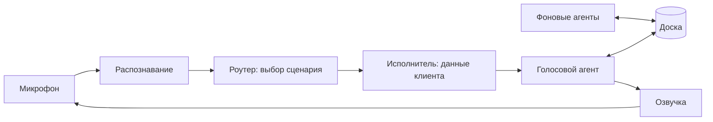

# Voice Router

Голосовой бот контакт-центра вымышленной страховой **Saqta Insurance**.
HackAlem AI, трек Halyk Bank, кейс 2.

Клиент говорит в микрофон по-русски, по-казахски или вперемешку. Бот понимает, что ему
нужно, выбирает один из 40 сценариев, отвечает голосом и показывает супервизору, почему
выбрал именно этот сценарий.

## Зачем

Обычно сценарий в голосовом роботе выбирает классификатор, обученный на фиксированных
фразах. Он ломается, когда человек говорит как человек: меняет тему, просит что-то на
стыке двух сценариев, переходит с русского на казахский посреди фразы.

Мы выбираем сценарий через LLM. Модель видит весь каталог и историю разговора, поэтому
справляется с живой речью, а если не уверена, переспрашивает или зовёт оператора.

## Запуск

Нужны Docker и [just](https://github.com/casey/just).

```bash
cp .env.example .env
just up
```

Интерфейс: http://localhost:3000, API и документация: http://localhost:8000/docs.

Без ключей проект запускается в демо-режиме: интерфейс работает, но вместо ответа модели
вы увидите понятную ошибку (`llm_unavailable`). Чтобы включить настоящие модели, добавьте
в `.env`:

```bash
OPENAI_API_KEY=sk-...
MOCK_MODE=false
LLM_PROVIDER=openai
STT_PROVIDER=openai
TTS_PROVIDER=openai
```

и перезапустите `just up`. Тесты — `just test`, точность роутера — `just eval`.

## Как это работает



1. **Распознавание.** Клиент держит кнопку и говорит, отпускает — запись сразу уходит на
   сервер и распознаётся (`gpt-4o-mini-transcribe`).
2. **Роутер** — один запрос к LLM. В промпте все 40 сценариев целиком, с границами между
   ними (`not_this_if`) дословно из кита. Ответ — строгий JSON: сценарий, уверенность,
   причина, альтернативы, слоты. Уверенность ≥ 0.75 — работаем, 0.45–0.75 — переспрашиваем,
   ниже дважды подряд — передаём оператору.
3. **Исполнитель** достаёт данные: заявление по номеру, клиента по телефону, офисы по
   городу. Каждый факт хранит ссылку на источник.
4. **Голосовой агент** отвечает, используя только эти факты.
5. **Озвучка** начинается с первого готового предложения, звук идёт в браузер кусками.

### Голос не ждёт агентов

Это главное отличие от обычного конвейера «сначала все модели, потом ответ».

Голосовой агент отвечает короткими фрагментами и начинает говорить сразу. Параллельно
фоновые агенты ищут по базе знаний и данным клиента и кладут найденное на общую доску.
Перед каждым следующим фрагментом голосовой агент перечитывает доску и подхватывает то,
что успело появиться. Кто не успел — попадёт в следующую реплику.

Поиск по базе стартует одновременно с роутером, а сразу после выбора сценария звучит
короткое «Секунду, проверяю». Поэтому время до первого звука определяет роутер, а не
самый медленный агент.

## Для супервизора

После каждой реплики в панели видно: что распознано, какой сценарий выбран и почему,
альтернативы с уверенностью, извлечённые данные, факты с источниками и время каждого
этапа. Вся история звонка хранится в базе, её можно открыть по ID сессии
(`/traces/sessions/{id}`), включая токены по каждой модели.

## Результаты

**Маршрутизация.** На 63 своих репликах (не из dev-набора): 62 из 62 верно, по-русски,
по-казахски и вперемешку. Среди них ловушки на границах сценариев, смена темы, попытка
заставить бота «одобрить выплату», вопросы не по теме. Цифры `just eval` на dev-наборе —
TODO, прогоним перед демо.

**Скорость** (живые замеры, `gpt-4.1-mini`):

| | сейчас | цель кейса |
|---|---|---|
| выбор сценария | 1.5–2.0 с | 0.5 с |
| до первого звука | 1.5–2.0 с | 1.5 с |

## Правила, которые бот не нарушает

- Факты только из данных, у каждого есть источник. Модель формулирует, но не выдумывает.
- Ничего необратимого без явного подтверждения клиента.
- Не обещает выплату, возврат денег или выпуск полиса — передаёт оператору вместе с
  контекстом разговора.
- Если не уверен — переспрашивает, а не угадывает.

## Ограничения

- Роутер пока медленнее цели в 0.5 с.
- С включёнными моделями реплики клиента уходят в OpenAI. Данные в ките выдуманные, но
  для реального контакт-центра нужна маскировка персональных данных или своя модель.
- Нет быстрого пути для очевидных запросов: каждая реплика идёт через LLM.
- SMS и перевод на оператора — заглушки.
- Один процесс backend: незавершённый ход не переживает перезапуск (история — переживает).
- Казахский мы проверяли сами, не с носителем языка.

## Что дальше

- Быстрый путь для очевидных фраз, LLM — только для сложных. Дешевле и быстрее.
- Телефония вместо браузера.
- Аналитика для супервизора: где бот переспрашивает и ошибается, что поправить в каталоге.
- Другие компании и отрасли: каталог сценариев — это данные, его можно менять через
  `/kit` без разработчика.
- Своя модель для компаний, которым нельзя отправлять данные наружу.

## Устройство репозитория

```
backend/app/     call, speech, router, executor, kernel, context, knowledge, tracer
frontend/src/    экран звонка, история, каталог сценариев, трассировка
datasets/        стартовый кит, не меняем
docs/adr/        архитектурные решения
docs/specs/      спецификации модулей
```

Решения — в [`docs/adr/`](docs/adr/), главная спецификация —
[`docs/specs/voice-router-spec.md`](docs/specs/voice-router-spec.md), правила работы
команды — в [`AGENTS.md`](AGENTS.md).
