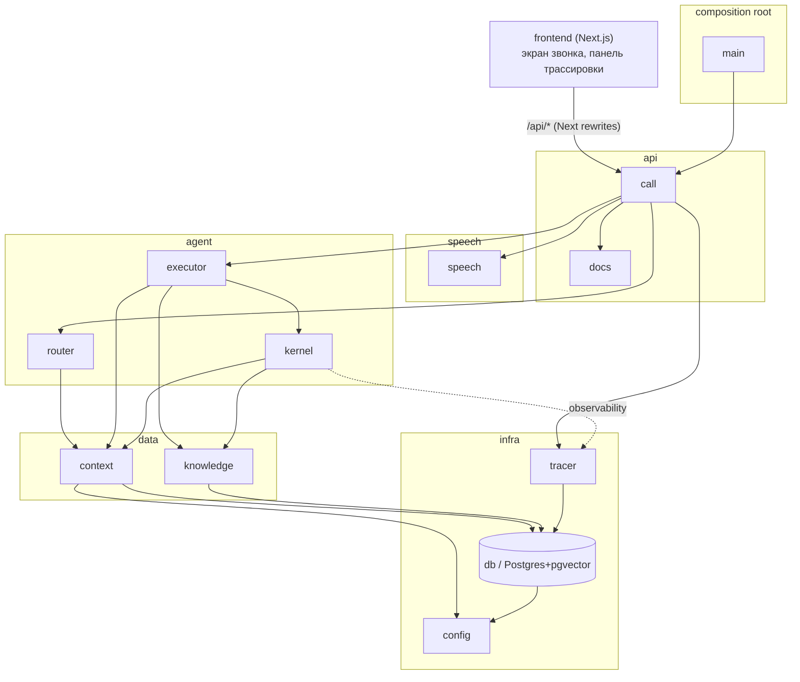

# Voice Router

**Голосовой ИИ-агент контакт-центра** для вымышленной страховой компании **Saqta Insurance**.
HackAlem AI, трек Halyk Bank, кейс 2.

Клиент звонит и говорит на русском, казахском или вперемешку. Backend распознаёт речь,
**LLM-роутер** выбирает один из 40 сценариев стартового кита (плюс `SYS_OUT_OF_SCOPE`,
`SYS_UNCLEAR`, `SYS_GOODBYE` — итого 43 карточки в каждом запросе к модели), исполнитель
сценария и агентное **ядро (kernel)** с фоновыми агентами читают факты из базы знаний с
указанием источника и стримят ответ в браузер текстом и голосом по мере генерации. Панель
трассировки показывает, почему выбран именно этот сценарий, какие факты использованы и
сколько заняла каждая стадия.

> Домен — только страхование. Все данные (клиенты, полисы, случаи, KB) синтетические.
> «Сегодня» в наборе данных — константа `2026-10-01`.

## Ключевые возможности

- **Маршрутизация по всем 40+3 сценариям.** Каталог не сужается: ни retrieval, ни
  intent-классификатор не решают за LLM — роутер получает все карточки сразу, включая
  `not_this_if` дословно из кита. Неизвестный `scenario_id` от модели — ошибка, а не
  «похожий» сценарий.
- **ru / kk / mixed.** Клиент может менять язык и тему прямо в середине фразы; роутер
  определяет язык реплики и извлекает слоты каждый раз заново поверх проверенного контекста.
- **Стриминг на всех уровнях.** SSE-события по каждой стадии хода (`transcript` →
  `routing` → `action`/`facts` → `reply.delta` → `audio` → `turn.done`), токены главного
  агента ядра приходят по мере генерации сегментами, TTS озвучивает уже готовые предложения,
  не дожидаясь всего ответа.
- **Blackboard-ядро с фоновыми агентами.** Один главный агент отвечает клиенту сегментами;
  N независимых фоновых агентов читают базу знаний параллельно и кладут факты на доску —
  главный подхватывает свежие результаты между сегментами одного ответа, а незавершённая
  работа продолжается в паузе между ходами (ADR 0011, 0015, 0016).
- **Гибридный RAG для базы знаний.** Postgres FTS + trigram (лексика) и pgvector
  (`text-embedding-3-large`) с ru/kk-расширениями вопросов для казахского языка —
  KB в ките только на английском.
- **Подтверждения и handoff по правилам.** Необратимое действие требует явного «да»,
  привязанного к конкретным параметрам; смена параметров или отмена подтверждение
  аннулирует. Обещания оформить полис, вернуть деньги или одобрить выплату запрещены —
  вместо этого честный handoff оператору с контекстом разговора.
- **OpenTelemetry-трассировка на каждый звонок.** Дерево спанов от HTTP-запроса до TTS,
  токены по каждой модели, история звонков, экспорт по OTLP в любой бэкенд (например, Jaeger).
- **Режим без ключей.** Без `OPENAI_API_KEY` весь стек поднимается и отвечает понятными
  ошибками (`llm_unavailable`, `stt_unavailable`) вместо непрозрачного 401 — так проверяющий
  видит рабочий каркас даже без доступа к провайдеру.

## Быстрый старт

Нужны **Docker** (с Compose v2) и **[just](https://github.com/casey/just)**. Ничего больше
устанавливать не нужно — миграции применяются автоматически при старте backend.

```bash
git clone git@github.com:BAITC-Hacks/hack-00030236-tr1k0taj.git voice-router
cd voice-router
cp .env.example .env     # без правок стартует в MOCK_MODE=true, без ключей
just up
```

| Сервис | Адрес |
|--------|-------|
| Веб-интерфейс | http://localhost:3000 |
| Backend API | http://localhost:8000 (интерактивная документация — `/docs`, OpenAPI) |
| Postgres (pgvector) | localhost:5432 |

Микрофон в браузере работает только на `localhost` или по HTTPS (ограничение
`getUserMedia`). Порты и учётные данные БД переопределяются переменными
`FRONTEND_PORT`, `BACKEND_PORT`, `POSTGRES_PORT`, `POSTGRES_USER/PASSWORD/DB` в `.env`.

### Включить живой режим (реальные LLM/STT/TTS)

По умолчанию `.env.example` держит проект в `MOCK_MODE=true` — без ключей провайдера
ничего не подделывается, ход останавливается понятной ошибкой на нужной стадии. Чтобы
включить настоящие LLM-роутер, распознавание и синтез речи через OpenAI, в `.env`:

```bash
OPENAI_API_KEY=sk-...
MOCK_MODE=false
LLM_PROVIDER=openai      # роутер: Responses API, gpt-4.1-mini (LLM_MODEL)
STT_PROVIDER=openai      # gpt-4o-mini-transcribe (STT_MODEL)
TTS_PROVIDER=openai      # gpt-4o-mini-tts (TTS_MODEL), голос alloy (TTS_VOICE)
```

затем `just up` (или `just reset`, если контейнеры уже подняты). Провайдеры включаются
независимо: можно оставить, например, `STT_PROVIDER=mock` и только `LLM_PROVIDER=openai`.
Полный список переменных — в [`.env.example`](.env.example) и `backend/app/config.py`.
Ключ используется только на backend; во фронтенд и в git он не попадает.

**Поведение без ключа (`MOCK_MODE=true` по умолчанию для каждого провайдера = `mock`):**
mock-STT честно отвечает `error stt_unavailable` и просит текстовый ввод; mock-роутер —
`error llm_unavailable` без выдуманного сценария; mock-TTS аудио не отдаёт. Ход при этом
не падает: клиент видит понятную ошибку и `turn.done`, а не разрыв соединения или 401.

## Демо-сценарий

1. `just up`, открыть http://localhost:3000, включить живой режим (см. выше).
2. Нажать кнопку записи (push-to-talk) и сказать: *«Здравствуйте, я хочу узнать статус
   моего страхового случая»* → маршрут `SC17`, бот просит телефон для идентификации.
3. Назвать номер клиента (например, один из `+7701...` в `datasets/mock_backend.json`) →
   бот находит клиента и обращение, называет статус со ссылкой на источник.
4. Сменить тему и язык: *«Ал сату кеңселеріңіз қайда орналасқан?»* (казахский, «а где ваши
   офисы продаж?») → маршрут `SC33`, ответ на казахском; затем вернуться к прежней теме —
   бот помнит прерванный `pending_topic`.
5. Смешанная фраза: *«Маған КАСКО бойынша осы month ішінде звонить болды ма, платеж списался?»*
   (смесь ru/kk/en) → роутер определяет язык и слоты несмотря на код-свитчинг.
6. Попросить необратимое действие (например, обновить контактные данные) — бот озвучивает
   параметры и явно просит подтверждение; изменение параметров или отказ аннулирует его.
7. В любой момент — кнопка «стоп»: текущий ход обрывается, доска фиксирует `turn.cancelled`,
   фоновые агенты, если их результат ещё актуален, продолжают работу.
8. Панель трассировки (вкладка «Трейс звонка» / `/traces`) — транскрипт, выбранный
   сценарий, альтернативы с уверенностью, слоты, факты с `source`/`source_id`, дерево
   спанов, токены по моделям и тайминги по стадиям для каждой реплики.

Реплики выше написаны для этого README и не входят в `datasets/dev_utterances.json`.

## Архитектура

### Модули и слои (ADR 0009, ADR 0012)

Backend — набор модулей `backend/app/<module>/`. Публичный API модуля — только его
`__init__.py`; общего `schemas/` нет, типы живут у модуля-владельца. Импорт разрешён
только «вниз» по слоям; соседи по слою независимы, кроме явно разрешённых пар
(`call ↔ docs`, `db → config`, `kernel ↔ router ↔ executor`). Проверяется автоматически
тестом `backend/tests/test_module_boundaries.py`.



### Один ход целиком

```mermaid
sequenceDiagram
    participant B as Браузер
    participant C as call (API + SSE)
    participant S as speech (STT/TTS)
    participant R as router (LLM, 1 вызов)
    participant E as executor (автомат сценария)
    participant K as kernel: главный агент
    participant BG as kernel: фоновые агенты (N)
    participant KN as knowledge (данные, RAG)

    B->>C: POST /calls/{id}/turns/audio (push-to-talk)
    C->>S: распознать речь
    S-->>C: transcript
    C-->>B: event: transcript
    C->>R: карточки 40+3 сценариев + проверенный контекст
    R-->>C: scenarios[], alternatives, language, slots, confidence
    C-->>B: event: routing
    Note over C: политика порогов: ≥0.75 route / 0.45–0.75 clarify /<br/>&lt;0.45 clarify → handoff, urgent — первым
    C->>E: решение (route/clarify/handoff)
    E->>KN: обязательные чтения (найти клиента, обращение, KB…)
    KN-->>E: факты + source/source_id
    E-->>C: event: action, event: facts
    E->>K: ReplyBrief (instruction, decision, facts, язык)
    par главный сегмент за сегментом
        K->>KN: rag_search / rag_read (по необходимости)
        K-->>C: response.delta → reply.delta (кусками)
    and фон читает параллельно
        BG->>KN: rag_search (только read-only allowlist)
        BG-->>K: новый факт на доске (подхватывается между сегментами)
    end
    K-->>C: response.completed
    C->>S: TTS по готовым предложениям
    S-->>C: аудио-чанк
    C-->>B: event: audio (seq), reply.done
    C-->>B: event: turn.done (latency_ms по стадиям, trace_id)
    B->>C: POST /turns/{id}/playback {played_ms, segments[]}
    Note over B,C: «стоп»: POST /turns/{id}/cancel — ход обрывается,<br/>актуальный фон не отменяется
```

### Модули

| Модуль | Слой | Отвечает за | Публичный API (одной строкой) |
|---|---|---|---|
| `main` | composition root | сборка приложения, lifespan, DI, миграции при старте | `app.main:app` |
| `call` | api | HTTP + SSE звонка, идемпотентность, replay, порты этапов | `CallService`, `build_providers`, `api_router` ([спека](docs/specs/call-api.md)) |
| `docs` | api | тексты и примеры для OpenAPI | используется только `call` |
| `speech` | speech | STT/TTS порты, mock- и OpenAI-адаптеры, разбиение ответа на предложения | `SpeechToText`, `TextToSpeech`, `build_stt/build_tts`, `split_sentences` ([спека](docs/specs/speech-module.md)) |
| `router` | agent | контракт LLM-роутера и политика порогов | `OpenAIRouter`, `RouterOutput`, `decide()` |
| `executor` | agent | автомат сценария поверх карточки кита, сборка `ReplyBrief` | `BaselineExecutor`, `TemplateResponder`, `ReplyBrief` ([спека](docs/specs/executor-module.md)) |
| `kernel` | agent | главный + N фоновых агентов, streaming, RAG-tools, playback/interrupt | `Runtime`, `AgentSpec`, `api_router` ([спека](docs/specs/agent-kernel.md), [blackboard-v2](docs/specs/blackboard-v2.md), [graph-loop](docs/specs/kernel-graph-loop.md)) |
| `context` | data | `SessionContext`, доска, версии, задачи, патчи, подтверждения | `Contexts`, `SessionContext`, `BoardEntry`, `Blackboard` ([спека](docs/specs/context-module.md)) |
| `knowledge` | data | каталог кита, клиенты/полисы/случаи/платежи, гибридный поиск, `/kit` CRUD | `Knowledge`, `open_knowledge`, `Catalog`, `Records`, `Search` ([спека](docs/specs/knowledge-module.md)) |
| `tracer` | infra | OpenTelemetry span'ы, хранение в Postgres, `/traces` API | `span()`, `TraceMiddleware`, `api_router` ([спека](docs/specs/tracer-module.md)) |
| `config` | infra | `Settings` из env, `DATASET_TODAY` | `settings` |
| `db` | infra | движок и фабрика сессий SQLAlchemy, `Base` | `SessionLocal`, `engine`, `Base` |

### Blackboard: общая память диалога

Единственный писатель состояния — модуль `context` (`Contexts`). Состояние сессии
(`SessionContext`) и append-only доска (`BoardEntry`/`BoardEvent`) хранятся в Postgres
JSONB (`sessions`, `board_entries`) — панель трассировки рендерит доску без
преобразований, это не отдельный лог.

- **`context_version`** растёт только при значимых изменениях контекста (новые слоты,
  факты, подтверждение); тайминги и события воспроизведения версию не двигают.
- **`generation`** растёт при «новом звонке» (`/calls/{id}/reset`) или смене клиента —
  история не протекает между звонками, старое поколение не может быть применено к новому.
- **`input_revision`** растёт при новом пользовательском вводе. Фоновые результаты одной
  ревизии независимы: принятие одного не инвалидирует другой; результаты устаревшей
  ревизии остаются на доске как `stale` и не участвуют в новом ответе.
- **Задачи (`BlackboardTask`, v2)** — у каждой темы разговора своя версия записей; правка
  факта отзывает зависимые от него выводы, а не весь диалог. `AgentSpec.reads` сужает вход
  агента до нужных ключей (по умолчанию — `['$message']`, вся история сообщений).
- **`visibility: public | internal`.** Наружу (SSE, `/context`, `/board`) идёт только
  пользовательский диалог и lifecycle-события; служебные результаты фона, tool calls и
  сырые промпты остаются `internal` и видны только через `/traces/*` (в замаскированном
  виде) — они никогда не публикуются как факт без проверки версии.

### Роутер (LLM, ADR 0004)

Один LLM-вызов на реплику. Вход — вся 43 карточки (40 сценариев + `SYS_*`) с полями
`description`, `not_this_if` (дословно из кита), `priority`, примерами ru/kk; системная
часть промпта кэшируется (prompt caching), меняется только диалог и проверенный контекст.
Ответ — строгий JSON в формате README кита: `scenarios: [{scenario_id, confidence, reason}]`
первым полем, плюс `alternatives`, `language`, `slots`, `is_continuation`. Pydantic отвергает
неизвестный `scenario_id` как ошибку, не подставляет «похожий» сценарий.

Пороги: **≥ 0.75** — `route`; **0.45–0.75** — `clarify` (переспрос с двумя вариантами);
**< 0.45** — `clarify`, а при повторном подряд провале — `handoff` оператору с контекстом.
При `route` сценарии с приоритетом `urgent` (ДТП, случай за границей, мошенничество)
обслуживаются первыми независимо от порядка в ответе модели.

### Kernel: главный + фоновые агенты

Главный агент отвечает клиенту **сегментами** (обычно по предложению) в рамках одного
`response_id`: перед каждым следующим сегментом он получает свежий снимок контекста,
включая только что принятые фоновые результаты — уже выданный текст не переписывается.
N фоновых агентов (по умолчанию — читатели базы знаний) работают параллельно, видят
только разрешённый read-only набор инструментов (`rag_search`, `rag_read`,
`blackboard_read`; без обновлений/удалений/SMS/оператора) и кладут факты на доску с
проверяемым источником. Триггеры `response.completed` и `record.changed` (ADR 0016)
дают фону дорабатывать в паузе между ходами, а не только гонку с первым сегментом
ответа — к следующему вопросу клиента факты уже готовы. Затухание гарантируют бюджеты
`kernel_max_runs_per_turn` / `kernel_max_runs_per_session` и квиесценция (граф крутится,
пока меняются входы, и не бесконечно).

**Playback и interrupt.** Фронт присылает `{segment_id, start_ms, end_ms}` по мере
проигрывания; полностью пройденный интервал — `heard`, текущий — `partially_heard`, ещё
не воспроизведённый — `unheard`, без подтверждения — `unknown` (а не считается услышанным
по умолчанию). «Стоп» атомарно закрывает `response_id`, отменяет генерацию и TTS;
актуальный фон не отменяется, поздний результат просто оседает записью на доске и
никогда сам не запускает речь.

### Knowledge / RAG

`Knowledge` — единственный фасад к киту: `catalog` (сценарии/действия/слоты, всегда полный
список 40+3), `records` (клиенты/полисы/обращения/платежи), `search` (гибридный поиск).
KB в ките — на английском, клиенты говорят на ru/kk, поэтому для каждой темы заранее
сгенерированы вопросы ru/kk/mixed (`backend/app/knowledge/expansions.json`, `just expand-kb`);
у записи несколько векторов, ранжирование объединяет лексику (Postgres FTS + trigram) и
pgvector-эмбеддинги (`text-embedding-3-large`) по RRF, с честным lexical fallback без ключа.
Kernel передаёт в `rag_query` английский `search_query` роутера вместе с исходной репликой
клиента. Качество поиска (`just eval-search`, 47 запросов, recall@1 / @3, режим hybrid +
`search_query`): **ru 1.00 / 1.00, kk 0.96 / 1.00, mixed 1.00 / 1.00** (ADR 0014); без ключа
(только лексика) — ru 0.83/1.00, kk 0.84/0.96, mixed 0.60/1.00. Разрешённые для RAG виды
документов: `kb`, `office`, `clinic`, `inspection_point` — клиенты, полисы и платежи через
общий документный поиск не отдаются.

### Трассировка (OpenTelemetry, ADR 0013)

Каждый ход — одна OTel-трасса от HTTP-запроса (`traceparent`/`x-trace-id`) через `stt` →
`router` → `executor` (+ дочерние `action`, `kb.read`, `rag.search`) → `responder` →
`segment` → `tts.sentence`; фоновые `agent.run` — отдельные трассы со `link` на ход. Span'ы
пишутся в Postgres (`trace_spans`) неблокирующей очередью с asyncio-сбросчиком (переполнение
считается в `dropped`, звонок не тормозит) и опционально уходят по OTLP (например, в
локальный Jaeger — переменная `OTEL_EXPORTER_OTLP_ENDPOINT`). LLM-span'ы размечены GenAI
semantic conventions (`gen_ai.*`), токены агрегируются по каждой модели без двойного счёта.
ПД (телефон, ИИН, email, ФИО) в атрибуты не пишется; промпты/транскрипт — только
`local.*`-атрибуты, видны панели локально и уходят в OTLP лишь при `TRACE_EXPORT_CONTENT=true`.

Панель читает: `GET /traces/sessions` (история звонков), `GET /traces/sessions/{uuid}`
(сквозная трасса конкретного звонка: ходы, cancel, playback, фон, токены по моделям),
`GET /traces/{trace_id}` (дерево спанов одного хода).

## HTTP API

Полные контракты — [`docs/specs/call-api.md`](docs/specs/call-api.md) (звонок и SSE) и
[`docs/specs/agent-kernel.md`](docs/specs/agent-kernel.md) (ядро). Интерактивная схема —
`GET /docs` после `just up`.

| Метод | Путь | Назначение |
|---|---|---|
| GET | `/health` | backend и БД живы |
| GET | `/capabilities` | провайдеры, режим моков, поддержанные действия, флаги ядра |
| POST | `/calls` | открыть звонок по UUID сессии фронта (идемпотентно) |
| POST | `/calls/{id}/reset` | новый звонок в той же сессии (`generation + 1`) |
| POST | `/calls/{id}/turns/text` | ход текстом → SSE-поток событий |
| POST | `/calls/{id}/turns/audio` | ход аудио (multipart) → SSE-поток событий |
| POST | `/calls/{id}/turns/{turn_id}/cancel` | «стоп»: остановить текущий ход |
| POST | `/calls/{id}/turns/{turn_id}/playback` | замер воспроизведения / позиция в аудио |
| GET | `/calls/{id}/router/last` | реальный промпт и сырой ответ роутера последнего хода |
| GET | `/calls/{id}/events?after=N` | replay сохранённых событий (idempotency, reconnect) |
| GET/POST | `/sessions/{id}/context`, `/board`, `/tasks`, `/records`, `/background/cancel` | снимок состояния и управление blackboard-задачами (модуль `context`) |
| POST/GET | `/sessions`, `/sessions/{id}/turns`, `/sessions/{id}/events`, `/interrupt`, `/playback` | прямой доступ к ядру в обход сценарного автомата (для отладки/интеграции) |
| GET | `/kernel/capabilities` | режим ядра, streaming, playback-протокол, лимиты |
| GET/POST | `/kit`, `/kit/search`, `/kit/reload` | каталог кита: список, CRUD, поиск, перезагрузка из `datasets/` |
| GET | `/traces/sessions`, `/traces/sessions/{id}`, `/traces/{trace_id}`, `/traces` | трассировка звонков (панель) |

### События SSE (`POST /turns/*`)

| event | когда |
|---|---|
| `transcript` | после STT (для текстового хода — сразу) |
| `turn.started` | ход зарегистрирован на доске |
| `routing` | роутер ответил и прошёл валидацию/политику: `decision`, `scenarios[]`, `alternatives`, `slots` |
| `action` | исполнитель вызвал действие: `name`, `mode`, `ok`, `result`/`error` |
| `facts` | зафиксированы факты хода: `key`, `value`, `source`, `source_id` |
| `reply.delta` | кусок текста ответа (main-сегменты ядра тоже приходят сюда) |
| `reply.done` | ответ целиком |
| `audio` | озвучено очередное предложение (`seq`, `mime`, `data` base64) |
| `error` | ошибка этапа: `stage`, `code`, `message`, `fatal` |
| `turn.cancelled` | ход остановлен по «стоп» |
| `turn.done` | конец хода: полная трассировка + `latency_ms` по стадиям + `trace_id` |

## Качество и оценка

- **`just test`** — ключевые тесты кода (валидация ответа роутера, пороги, подтверждения,
  применение патчей контекста, границы модулей, smoke `/health`); без Docker — `just
  test-local`. LLM и внешние API не вызываются (`MOCK_MODE=true`), проходит быстрее минуты.
- **`just lint`** — `ruff check` (backend) + `npm run lint` (frontend).
- **`just eval`** — точность роутера на всех 104 репликах `dev_utterances.json` реальной
  моделью (нужен `OPENAI_API_KEY`), оценка — исходным `evaluate.py` кита. Разметка `expected`
  роутеру не передаётся, её видит только evaluator. Метрики (primary accuracy, full match,
  multi-intent recall, разбивка ru/kk/mixed):

  | Метрика | ru | kk | mixed |
  |---|---|---|---|
  | primary accuracy | TODO(hack): см. последний прогон `just eval` | — | — |
  | full match | TODO(hack): см. последний прогон `just eval` | — | — |
  | multi-intent recall | TODO(hack): см. последний прогон `just eval` | — | — |

  Актуальные числа сохраняются в `backend/evals/router_eval_result.json` (не в git) —
  прогонять локально с ключом перед демо и вписывать сюда.
- **`just eval-search`** — recall@1/@3 гибридного поиска KB по 47 запросам ru/kk/mixed;
  последний измеренный результат — в разделе [Knowledge / RAG](#knowledge--rag) выше и в
  [ADR 0014](docs/adr/0014-kazakh-kb-search.md).
- **Latency budget.** Замеряются отдельно: STT, роутер, обязательные чтения, время до
  первого токена ответа, полная генерация ответа, время до первого аудиочанка TTS, и
  отдельно в браузере — от конца речи клиента до начала воспроизведения (`/playback`).
  Параллельные ветки (главный сегмент и фон) не складываются в общий бюджет — это была бы
  нечестная метрика. Числа по стадиям для конкретного звонка — во вкладке трассировки и в
  `turn.done.latency_ms`.

## Инварианты и безопасность

- `DATASET_TODAY = 2026-10-01` — единственный источник «сегодня» в доменной логике,
  `date.today()` не используется.
- Роутинг — по всем 40 сценариям + 3 системным намерениям, каталог никогда не сужается
  retrieval-слоем или классификатором.
- Факты (выплата, документ, полис, платёж, KB-ответ) — только из данных, с `source` и
  `source_id`; LLM выбирает маршрут и формулирует ответ, но не выдумывает факты.
- Необратимое действие выполняется только после явного подтверждения, привязанного к
  конкретным параметрам — их смена или отказ подтверждение аннулируют.
- Не обещаем выпуск полиса, возврат денег или одобрение выплаты — такие случаи уходят
  в handoff оператору с полным контекстом разговора.
- SMS и передача оператору — моки с видимым результатом в трассировке, реальные внешние
  каналы не задействованы.
- **PII и внешние провайдеры.** Ключ провайдера живёт только на backend. При включённом
  живом режиме (`MOCK_MODE=false`) в OpenAI уходят: аудио реплики (`STT_PROVIDER=openai`),
  текст диалога и карточки сценариев (`LLM_PROVIDER=openai`, роутер и генерация ответа),
  текст ответа для синтеза (`TTS_PROVIDER=openai`) и, для поиска по KB, эмбеддинги текста
  запроса. Сырые байты аудиозаписи клиента после обработки не сохраняются. В атрибуты
  трассировки (в том числе в OTLP) телефон, ИИН, email и ФИО не пишутся никогда; промпты и
  транскрипт видны в локальной панели и уходят наружу только при явном
  `TRACE_EXPORT_CONTENT=true`.

## Ограничения

Честно, как требует `AGENTS.md`:

- **Не все действия из `actions.json` исполняются сквозным вызовом.** Реализованный
  end-to-end `BaselineExecutor` умеет только `transfer_to_operator` как настоящее действие
  (`supported_actions = ["transfer_to_operator"]`, `backend/app/executor/baseline.py`).
  Чтения по клиентам (`find_client`, `get_claim`, `check_payment`, `update_contact`) уже
  реализованы как методы модуля `knowledge` (`Records`) и готовы к подключению, но пока не
  вызываются диспетчером действий в реальном ходе; агенты ядра сегодня видят только
  документный RAG (`kb`, `office`, `clinic`, `inspection_point` — покрывает `kb_lookup`,
  `get_offices`). Остальные действия из кита ведут к честному handoff оператору.
- **Один backend-процесс (`asyncio`, без Redis/Celery).** После рестарта незавершённые
  ходы закрываются явным событием, автоматическое восстановление вычислений не входит в
  эту поставку; история и трассы переживают рестарт (Postgres), активные задачи — нет.
- **Трассы не имеют TTL** — `trace_spans` растёт без ограничения; для демо этого достаточно,
  для продакшена нужны партиционирование/ретеншн (`TODO(hack)` в `docs/specs/tracer-module.md`).
- **Казахский голос и качество.** Казахские tts-голоса и распознавание не проверялись
  отдельным native speaker'ом; recall поиска по KB на kk выше с `search_query` (0.96/1.00),
  но без него заметно проседает (0.84/0.96) — см. [ADR 0014](docs/adr/0014-kazakh-kb-search.md).
  Ru/kk-расширения для KB сгенерированы LLM и не вычитаны носителем языка.
- **Голос — push-to-talk, без барж-ина.** Частичных результатов распознавания (partial
  ASR) нет; стриминг относится к событиям ответа сервера, а не к входящей речи (ADR 0008).
- **SMS и оператор — моки** с видимым в трассировке результатом, реальные каналы не
  подключены.
- **Нет production-авторизации.** Идентификаторы сессий случайные, HTTP API рассчитан на
  доверенное хакатонное окружение, а не на публичный интернет.
- **`ALLOWED_EXCEPTIONS` в `test_module_boundaries.py`** зарезервирован под временные
  нарушения границ модулей — на момент публикации README пуст, но может появиться в ходе
  быстрой разработки с пометкой `# TODO(hack):`.
- Данные полностью синтетические; `DATASET_TODAY = 2026-10-01` — не реальная дата.

## Структура репозитория

```
compose.yaml, justfile, .env.example, README.md
datasets/              # стартовый кит без изменений (ADR 0002), см. datasets/README.ru.md
docs/
  adr/                 # решения (таблица ниже)
  specs/               # спеки фич и модулей
  dataset-guide.md     # путеводитель по файлам кита
backend/
  app/<module>/        # call, docs, speech, router, executor, kernel, context, knowledge, tracer, config, db
  migrations/          # alembic
  tests/               # ключевые тесты (just test)
  evals/                # just eval / just eval-search
frontend/
  src/app/             # экран звонка (page.tsx), история (history/), каталог (scenarios/), трейсы (traces/)
  src/components/       # call-workspace, session-trace, trace-journal, scenario-catalog, voice-provider…
  src/hooks/            # use-recorder, use-audio-queue, use-trace-resource, use-preferences
  src/lib/              # api.ts, call-contract.ts, trace-contract.ts, sse.ts, catalog.ts, i18n.ts
```

### ADR (`docs/adr/`)

| ADR | О чём |
|---|---|
| [0001](docs/adr/0001-stack-and-architecture.md) | Стек: FastAPI, Postgres, Next.js, compose, just |
| [0002](docs/adr/0002-starter-kit-as-data.md) | Стартовый кит как данные, `DATASET_TODAY`, все 40 сценариев |
| [0003](docs/adr/0003-blackboard-session-state.md) | Доска (blackboard), `SessionContext`, версии контекста |
| [0004](docs/adr/0004-llm-router.md) | LLM-роутер: карточки, JSON-контракт, пороги 0.75/0.45 |
| [0005](docs/adr/0005-scenario-executor.md) | Исполнитель сценариев, действия, подтверждения, handoff |
| [0006](docs/adr/0006-background-assistant.md) | Фоновый помощник, патчи контекста, гейт по accuracy |
| [0007](docs/adr/0007-evaluation-gate.md) | `just eval`, метрики по ru/kk/mixed |
| [0008](docs/adr/0008-voice-and-providers.md) | Голос push-to-talk, провайдеры, режим без ключей |
| [0009](docs/adr/0009-modular-backend.md) | Модульный backend, публичный API в `__init__.py`, без общего `schemas/` |
| [0011](docs/adr/0011-multi-agent-kernel.md) | Streaming blackboard kernel: N фоновых агентов + главный, общий RAG |
| [0012](docs/adr/0012-module-layers.md) | Слои модулей и автоматическая проверка направления импортов |
| [0013](docs/adr/0013-tracer-opentelemetry.md) | Трассировка хода в формате OpenTelemetry, хранение в Postgres |
| [0014](docs/adr/0014-kazakh-kb-search.md) | Казахский поиск по KB: ru/kk-расширения, несколько векторов на запись |
| [0015](docs/adr/0015-blackboard-context-v2.md) | Blackboard v2: задачи, зависимости записей, единая история |
| [0016](docs/adr/0016-self-sustaining-agent-graph.md) | Самоподдерживающийся граф фоновых агентов между ходами |

### Спеки (`docs/specs/`)

- [voice-router-spec.md](docs/specs/voice-router-spec.md) — главная спека (предметные требования)
- [agent-kernel.md](docs/specs/agent-kernel.md) — контракт и план ядра
- [blackboard-v2.md](docs/specs/blackboard-v2.md) — задачи, версии записей, единая история
- [kernel-graph-loop.md](docs/specs/kernel-graph-loop.md) — граф фоновых агентов между ходами
- [call-api.md](docs/specs/call-api.md) — HTTP/SSE звонка
- [context-module.md](docs/specs/context-module.md) — состояние звонка, доска, версии, подтверждения
- [executor-module.md](docs/specs/executor-module.md) — исполнитель сценариев, ответ, фон
- [knowledge-module.md](docs/specs/knowledge-module.md) — загрузка кита, каталог, данные, поиск
- [speech-module.md](docs/specs/speech-module.md) — порты и адаптеры STT/TTS
- [tracer-module.md](docs/specs/tracer-module.md) — OpenTelemetry-трассировка
- [voice-router-frontend.md](docs/specs/voice-router-frontend.md) — дизайн-ТЗ фронтенда
- [voice-client-implementation.md](docs/specs/voice-client-implementation.md) — реализация клиента
- [frontend-catalog-api.md](docs/specs/frontend-catalog-api.md) — каталог сценариев из API
- [frontend-traces.md](docs/specs/frontend-traces.md) — панель трассировки на клиенте
- [frontend-review-flow.md](docs/specs/frontend-review-flow.md) — понятный просмотр звонка для жюри

## Команда и роли

Проект сделан за один хакатон тремя зонами ответственности (без привязки к именам —
подробнее в [`AGENTS.md`](AGENTS.md)):

| Зона | Ответственность | Основные пути |
|---|---|---|
| **A** | роутер, сценарный автомат, ядро, контракты, eval | `backend/app/router/`, `backend/app/executor/`, `backend/app/kernel/`, `backend/app/context/`, `eval/` |
| **B** | веб-интерфейс, браузерное аудио, панель трассировки | `frontend/` |
| **C** | речевые адаптеры, данные, знания/RAG, запуск, README | `backend/app/speech/`, `backend/app/knowledge/`, `compose.yaml`, `README.md` |

## Разработка

Правила для людей и AI-агентов, инварианты, git-флоу — в [`AGENTS.md`](AGENTS.md)
(единственный источник правды; `CLAUDE.md` его только подключает). Коротко:

- Ветки `feat/<short>`, `fix/<short>`, `docs/<short>`, `infra/<short>`; коммиты — Conventional
  Commits; merge — squash в `main` только через PR, прямые пуши запрещены.
- Перед PR: `git fetch && git rebase origin/main`, `just up` и `just test` — зелёные; если
  менялись роутер или карточки сценариев — `just eval` и цифры в описании PR.
- Основные команды: `just up` / `down` / `reset` / `nuke`, `just logs [service]`, `just test`
  (`just test-local` без Docker), `just lint`, `just eval` / `just eval-local`, `just
  eval-search`, `just load-data`, `just expand-kb`, `just migrate`, `just migration "msg"`,
  `just psql`, `just sh [service]`. Полный список — `just`.

## Материалы кейса и данные

Исходный комплект кейса 2 — в [`datasets/`](datasets/), все 11 файлов сохранены без
изменений; backend монтирует их read-only по пути `/datasets`. Начните с
[русского README кита](datasets/README.ru.md) и [путеводителя по данным](docs/dataset-guide.md).

- **Каталог и контракты:** `scenarios.json` (40 сценариев + 3 системных намерения),
  `actions.json`, `slots.json`.
- **Факты для ответов:** `knowledge_base.json`, `mock_backend.json` (11 клиентов, 11 полисов,
  4 обращения, 2 платежа).
- **Примеры и оценка:** `dialogs_sample.json`, `dev_utterances.json` (104 реплики),
  `evaluate.py`.
