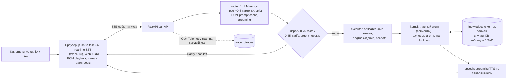

# Voice Router

Голосовой ИИ-агент контакт-центра для вымышленной страховой компании **Saqta Insurance**
(HackAlem AI, трек Halyk Bank, кейс 2).

## Проблема и решение

Роботы контакт-центров обычно выбирают сценарий диалога энкодер-классификатором намерений:
он обучен на фиксированном наборе фраз и ломается на живой речи — смена темы посреди
разговора, реплика на границе двух сценариев, переключение ru↔kk в пределах одной фразы.
Мы убрали этот слой и поставили на его место **LLM-роутер**, который видит весь диалог и
понимает контекст, а не сравнивает эмбеддинги. Дальше исполнитель читает факты из данных,
бот отвечает голосом, а супервизор в панели трассировки видит, **почему** выбран именно
этот сценарий: карточка, причина, альтернативы с уверенностью и тайминг каждой стадии.

> Домен — только страхование, все данные синтетические. «Сегодня» — константа
> `DATASET_TODAY = 2026-10-01`.

## Быстрый старт

Нужны **Docker** (с Compose v2) и **[just](https://github.com/casey/just)** — больше ничего
устанавливать не нужно, миграции применяются автоматически при старте backend.

```bash
git clone git@github.com:BAITC-Hacks/hack-00030236-tr1k0taj.git voice-router
cd voice-router
cp .env.example .env     # без правок — MOCK_MODE=true, без ключей
just up
```

| Сервис | Адрес |
|---|---|
| Веб-интерфейс | http://localhost:3000 |
| Backend API (+ `/docs`) | http://localhost:8000 |
| Postgres (pgvector) | localhost:5432 |

Микрофон в браузере работает только на `localhost` или по HTTPS (ограничение
`getUserMedia`).

**Без ключа проект честно работает в моках:** `MOCK_MODE=true` по умолчанию — вместо
скрытого 401 API отвечает понятной ошибкой (`llm_unavailable`, `stt_unavailable`), ход не
падает, клиент видит `turn.done`.

**Включить живой режим** (реальные LLM/STT/TTS через OpenAI) — в `.env`:

```bash
OPENAI_API_KEY=sk-...
MOCK_MODE=false
LLM_PROVIDER=openai   # роутер и ответ: gpt-4.1-mini (LLM_MODEL)
STT_PROVIDER=openai   # gpt-4o-mini-transcribe
TTS_PROVIDER=openai   # gpt-4o-mini-tts, голос alloy
TTS_FILLER=true       # короткая фраза-заглушка сразу после route-решения
```

затем `just up` (или `just reset`). Провайдеры включаются независимо друг от друга. Ключ
используется только на backend и в git не попадает.

```bash
just test   # ключевые тесты кода, без LLM и внешних API, < 1 минуты
just eval   # точность роутера на dev-наборе (нужен OPENAI_API_KEY), ADR 0007
```

## Архитектура



Один ход: STT → **router** (1 LLM-вызов, весь каталог сразу, ответ — строгий JSON с
`scenario_id`/`confidence`/`reason`) → политика порогов → **executor** читает факты с
`source`/`source_id` и решает route/clarify/handoff → **kernel**: главный агент стримит
ответ сегментами, фоновые read-only агенты параллельно ищут в базе знаний и кладут факты
на общую доску (blackboard) — главный подхватывает их между сегментами → **speech**
озвучивает уже готовые предложения, не дожидаясь всего ответа. Ровно два LLM-вызова в
критическом пути: роутер и формулировка ответа.

Backend — модули `backend/app/<module>/`, каждый доступен соседям только через свой
`__init__.py` (ADR 0009, 0012):

| Модуль | Отвечает за |
|---|---|
| `call` | HTTP + SSE звонка, идемпотентность, replay событий |
| `speech` | STT/TTS порты, mock- и OpenAI-адаптеры, realtime-сессия |
| `router` | LLM-контракт роутера, пороги, приоритет `urgent` |
| `executor` | автомат сценария, обязательные чтения, подтверждения, handoff |
| `kernel` | главный + N фоновых агентов, streaming, blackboard, playback/interrupt |
| `context` | `SessionContext`, доска, версии, задачи, подтверждения |
| `knowledge` | единственный фасад к киту: каталог, клиенты/полисы/случаи, гибридный поиск, `/kit` CRUD |
| `tracer` | OpenTelemetry-спаны на каждый ход, `/traces` API |

## Возможности

**Обязательные требования кейса:**

- Голос в браузере — push-to-talk (микрофон → распознавание) и озвученный ответ.
- Сценарий выбирает **LLM**, а не intent-классификатор и не retrieval: карточки со всех
  40 сценариев + `SYS_OUT_OF_SCOPE`/`SYS_UNCLEAR`/`SYS_GOODBYE` идут в промпт целиком,
  включая `not_this_if` дословно из кита. Неизвестный `scenario_id` от модели — ошибка.
- **ru / kk / mixed** — язык и слоты извлекаются заново на каждой реплике, клиент может
  сменить язык и тему прямо в середине фразы.
- Панель трассировки супервизора: выбранный сценарий, причина, альтернативы с
  уверенностью, слоты, факты с источником, дерево спанов и тайминг каждой стадии.

**Что добавили сверх минимума:**

- Удержание контекста и возврат к прерванной теме (`pending_topic`) после ухода в сторону.
- Переспрос вместо угадывания в зоне неуверенности, честный handoff оператору с полным
  контекстом при повторном провале уверенности.
- Извлечение слотов поверх проверенного контекста, а не с нуля на каждый ход.
- Потоковая обработка на всех уровнях: SSE по стадиям хода, токены ответа сегментами,
  TTS по готовым предложениям.
- История звонков и трассировки в отдельной панели (`/traces`), не только текущий ход.
- Редактирование каталога сценариев без разработчика — `GET/POST /kit`, `/kit/search`,
  `/kit/reload`.

**Для латентности:**

- Гибридный RAG-поиск по базе знаний (Postgres FTS + trigram + pgvector) стартует
  параллельно с LLM-роутером (`rag_prefetch`), а не после него.
- Streaming TTS — озвучивание идёт по мере готовности предложений, а не всего ответа.
- Мгновенная фраза-заглушка (`TTS_FILLER`) сразу после route-решения, пока готовится ответ.
- Realtime STT через WebRTC как альтернатива push-to-talk записи.
- Prompt caching системной части промпта роутера — на каждый ход обновляется только диалог.

## Качество и скорость

`just eval` считает точность роутера по 104 репликам `dev_utterances.json` реальной
моделью (`evaluate.py` из кита, разметку `expected` роутер не видит):

| Метрика | ru | kk | mixed |
|---|---|---|---|
| primary accuracy | TODO(hack): см. последний прогон `just eval` | — | — |
| full match | TODO(hack): см. последний прогон `just eval` | — | — |

Дополнительно — своя живая проверка на 63 репликах (не из dev-набора, ловушки
`not_this_if`, попытки prompt injection, вне-доменные запросы), измерена до последних
perf-правок роутера: **top-1 маршрутизация 62/62** (ru 40/40, kk 15/15, mixed 7/7).

Латентность (живое измерение на текстовых ходах, модель `gpt-4.1-mini`, честно —
целевые 500 мс пока не достигнуты):

| Стадия | Время |
|---|---|
| Роутер (1 LLM-вызов) | ~1.5–2.0 с |
| Первый аудио-чанк от запроса | ~1.7–2.0 с (фраза-заглушка) |
| Первый токен ответа после роутинга | ~0.8–1.0 с |

## Безопасность и доверие

- Факты (выплата, документ, полис, платёж, ответ KB) — только из данных, с `source` и
  `source_id`; LLM выбирает маршрут и формулирует ответ, но не выдумывает факты.
- Необратимое действие — только после явного подтверждения, привязанного к конкретным
  параметрам; их смена или отказ подтверждение аннулируют.
- Не обещаем выпуск полиса, возврат денег или одобрение выплаты — это handoff оператору с
  полным контекстом разговора, а не отказ без объяснения.
- Неуверенность видна, а не скрыта: переспрос при уверенности 0.45–0.75, alternatives в
  трассировке, `urgent`-сценарии (ДТП, мошенничество) обслуживаются первыми.
- Объяснимость — весь путь хода виден в панели трассировки, включая факты и их источник.
- `DATASET_TODAY = 2026-10-01` — единственный источник «сегодня» в доменной логике.

## Ограничения (честно)

- Латентность роутера выше целевых 500 мс (см. таблицу выше) — есть куда оптимизировать.
- Один backend-процесс на `asyncio`, без Redis/Celery; активные ходы не переживают
  рестарт (история и трассы в Postgres — переживают).
- Realtime STT через WebRTC проверена только вызовом API напрямую; путь из браузера
  зависит от стабильности WebRTC на конкретном устройстве и сети.
- В живом режиме реплики клиента (в них может встретиться устно или текстом номер
  телефона или ИИН) уходят в OpenAI. Данные синтетические, но для продакшена нужны
  маскирование ПД и/или локальная модель.
- Качество казахского зависит от модели провайдера; отдельно носителем языка не сверялось.
- SMS и передача оператору — моки с видимым результатом в трассировке.
- Гибридного быстрого пути (дешёвая проверка на очевидные запросы перед LLM) пока нет —
  каждый ход идёт через полный роутер.
- Цифры `just eval` по dev-набору — TODO, прогонять перед демо с `OPENAI_API_KEY`.

## Потенциал развития

**Сейчас:** каталог сценариев — данные (`scenarios.json`/`actions.json`/`slots.json`),
редактируется через `/kit` без правки кода — смена домена не требует деплоя.

**Дальше:**
- Гибридный быстрый путь: кэш/эмбеддинг-фильтр для очевидных реплик, LLM — только для
  сложных случаев (снижает и латентность, и стоимость звонка).
- Телефония вместо браузерного микрофона — интеграция по SIP/Twilio или локальной АТС.
- Аналитика супервизора поверх накопленных трасс: доля переспросов и handoff, очередь
  низкой уверенности, предложения по правке карточек каталога из реальных ошибок.

**Позже:**
- Мультитенантность: несколько контакт-центров и каталогов на одном ядре.
- On-prem/локальная LLM и казахский STT — для доменов, где ПД нельзя отправлять во
  внешний API.
- Адаптация тона ответа, A/B моделей роутера, стоимость звонка по токенам из трассировки.

## Структура репозитория

```
compose.yaml, justfile, .env.example, README.md
datasets/            # стартовый кит без изменений (ADR 0002)
docs/adr/            # решения
docs/specs/          # спеки фич и модулей
backend/app/<module>/ # call, speech, router, executor, kernel, context, knowledge, tracer
backend/migrations/  # alembic
backend/tests/       # ключевые тесты (just test)
backend/evals/       # just eval / just eval-search
frontend/src/app/    # экран звонка, история, каталог сценариев, трейсы
```

### ADR (`docs/adr/`)

| ADR | О чём |
|---|---|
| [0001](docs/adr/0001-stack-and-architecture.md) | Стек: FastAPI, Postgres, Next.js, compose, just |
| [0002](docs/adr/0002-starter-kit-as-data.md) | Стартовый кит как данные, `DATASET_TODAY` |
| [0003](docs/adr/0003-blackboard-session-state.md) | Доска (blackboard), `SessionContext` |
| [0004](docs/adr/0004-llm-router.md) | LLM-роутер: карточки, JSON-контракт, пороги |
| [0005](docs/adr/0005-scenario-executor.md) | Исполнитель сценариев, действия, handoff |
| [0006](docs/adr/0006-background-assistant.md) | Фоновый помощник, патчи контекста |
| [0007](docs/adr/0007-evaluation-gate.md) | `just eval`, метрики по ru/kk/mixed |
| [0008](docs/adr/0008-voice-and-providers.md) | Голос push-to-talk, провайдеры, режим без ключей |
| [0009](docs/adr/0009-modular-backend.md) | Модульный backend, публичный API в `__init__.py` |
| [0011](docs/adr/0011-multi-agent-kernel.md) | Streaming blackboard kernel: главный + фоновые агенты |
| [0012](docs/adr/0012-module-layers.md) | Слои модулей, проверка направления импортов |
| [0013](docs/adr/0013-tracer-opentelemetry.md) | Трассировка хода в OpenTelemetry |
| [0014](docs/adr/0014-kazakh-kb-search.md) | Казахский поиск по KB |
| [0015](docs/adr/0015-blackboard-context-v2.md) | Blackboard v2: задачи, зависимости записей |
| [0016](docs/adr/0016-self-sustaining-agent-graph.md) | Граф фоновых агентов между ходами |

### Спеки (`docs/specs/`)

Главная — [voice-router-spec.md](docs/specs/voice-router-spec.md). Дальше — по модулям:
[agent-kernel.md](docs/specs/agent-kernel.md), [call-api.md](docs/specs/call-api.md),
[context-module.md](docs/specs/context-module.md),
[executor-module.md](docs/specs/executor-module.md),
[knowledge-module.md](docs/specs/knowledge-module.md),
[speech-module.md](docs/specs/speech-module.md),
[tracer-module.md](docs/specs/tracer-module.md); фронтенд —
[voice-router-frontend.md](docs/specs/voice-router-frontend.md),
[frontend-traces.md](docs/specs/frontend-traces.md).

### Команда

| Зона | Ответственность |
|---|---|
| **A** | роутер, сценарный автомат, ядро, контракты, eval |
| **B** | веб-интерфейс, браузерное аудио, панель трассировки |
| **C** | речевые адаптеры, данные, знания/RAG, запуск, README |

Правила разработки, git-флоу и полные инварианты — в [`AGENTS.md`](AGENTS.md).
