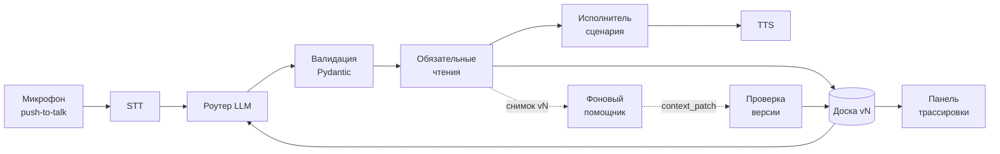

# Voice Router — спецификация разработки

**Проект:** HackAlem AI, трек Halyk Bank, кейс 2 — Voice Router
**Домен данных:** вымышленная страховая компания Saqta Insurance
**Дата:** 23 сентября 2026
**Горизонт:** 3 часа разработки

---

## 0. Как пользоваться документом

Разделы 1–3 — общий контекст, читают все. Разделы 4–9 — контракты и модули, это рабочая часть для разработчика. Разделы 10–13 — то, по чему нас оценивают. Разделы 14–17 — план, приёмка, демо.

Правило конфликта: **README стартового кита и `scenarios.json` главнее этого документа.** Если формат в ките отличается от описанного здесь — прав кит, документ правим.

Обозначения: 🔴 — must-have по ТЗ, без этого не сдаём; 🟡 — даёт баллы; ⚪ — вне объёма на сегодня.

---

## 1. Контекст и инварианты

### 1.1. Что оценивается

| Критерий | Баллы | Чем закрываем |
| --- | --- | --- |
| Соответствие задаче и работоспособность | 25 | 10 реплик жюри проходят голосом, доля попаданий |
| Техническая реализация | 25 | LLM-слой, доска, версионирование, фоновый помощник |
| README и воспроизводимость | 25 | запуск одной командой, эксперт запускает сам |
| Ценность и применимость | 15 | handoff с контекстом, подтверждение действий |
| Потенциал и оригинальность | 10 | blackboard-архитектура, каталог как данные |

Из этого следует приоритет: **точность маршрутизации и воспроизводимость важнее любой фичи.**

### 1.2. Инварианты данных

- Домен — страхование. Не доставка, не кредиты. Примеры, демо и тексты — страховые.
- «Сегодня» в наборе — **2026-10-01**. «Вчера» = 2026-09-30 независимо от системной даты. Зашить константу `DATASET_TODAY`, не использовать `date.today()`.
- Маршрутизация идёт по **всем 40 сценариям** плюс `SYS_OUT_OF_SCOPE`, `SYS_UNCLEAR`, `SYS_GOODBYE`. Сужать каталог до демо-подмножества запрещено.
- Диалог до 10 реплик.
- Данные синтетические, персональные данные во внешние API не уходят.

### 1.3. Состав стартового кита

| Файл | Содержимое | Как используем |
| --- | --- | --- |
| `scenarios.json` | 40 сценариев: назначение, `not_this_if`, приоритет, примеры ru/kk | источник карточек для промпта роутера |
| `actions.json` | ~31 описание действий | контракты исполнителя, разделение read/write |
| `slots.json` | ~43 слота | схема параметров |
| `mock_backend.json` | тестовые клиенты, полисы, обращения, платежи | источник фактов |
| `knowledge_base.json` | факты о компании | источник фактов |
| `dialogs_sample.json` | 10 размеченных диалогов | ручная проверка поведения |
| `dev_utterances.json` | 104 размеченные реплики | автоматическая метрика |
| `evaluate.py` | скрипт оценки | гейт качества, вызывается через `just eval` |

10 проверочных реплик жюри не выдаются. Ожидаемые ответы dev-набора держим **только внутри evaluator**, логика не обучается на точных строках.

---

## 2. Область работ

### 2.1. Must-have 🔴

1. Голосовое взаимодействие в вебе: микрофон → распознавание → голосовой ответ. Текст — резервный канал, не замена.
2. Выбор сценария LLM-слоем. Готовый intent-классификатор как решающий слой не засчитывается. Уметь показать устройство слоя живьём.
3. Корректность выбора на 10 репликах жюри: простые, со сменой темы, смешанной речью, на стыке сценариев.
4. Панель трассировки после каждой реплики: транскрипт, сценарий, обоснование, альтернативы, время по этапам.
5. Русский и казахский, включая смешение внутри фразы.
6. Запуск одной командой, README, воспроизводимость.

### 2.2. Берём сверх минимума 🟡

- Стек отложенных тем и возврат к прерванной теме.
- Переспрос вместо угадывания при средней уверенности.
- Передача оператору вместе с контекстом.
- Извлечение параметров из речи.
- Подтверждение перед необратимым действием.
- Фоновый помощник по обращению (при прохождении гейта, см. 14.3).
- Добавление сценария без разработчика.

### 2.3. Вне объёма ⚪

Полный duplex и barge-in, анализ эмоций, несколько фоновых агентов, внешняя CRM, самостоятельные фоновые изменения полиса, сложный streaming ASR, оформление сверх читаемого.

---

## 3. Архитектура

### 3.1. Принцип

Общая рабочая память диалога — **доска** (blackboard). Все компоненты пишут туда типизированные записи, роутер читает оттуда. Панель трассировки — рендер той же доски, а не отдельный лог. Супервизор видит рабочую память в момент решения.

Критический путь содержит ровно **два LLM-вызова**: роутер и исполнитель сценария. Всё остальное вынесено за пределы ответа.

### 3.2. Схема



### 3.3. Границы ответственности

| Слой | Решает | Не решает |
| --- | --- | --- |
| Роутер LLM | какие сценарии, язык, слоты, продолжение ли | что выполнять, какие данные истинны |
| Валидация | формат, известные ID | содержательный выбор |
| Исполнитель (обычный код) | приоритет, сбор слотов, допустимость действия, подтверждение, handoff | формулировку |
| Генератор ответа LLM | формулировку на нужном языке | факты |
| Данные | факты о клиенте, обращении, платеже, KB | маршрут |
| Фоновый помощник | какие дополнительные чтения полезны | действия, подтверждения, маршрут |

**Правило источника истины:** LLM выбирает маршрут и формулирует. Любой факт о выплате, документе, полисе или платеже приходит из данных и несёт источник.

### 3.4. Стек

FastAPI + Next.js + PostgreSQL, Docker Compose, `just`. Один процесс backend достаточно; перезапуск завершает активный звонок. Состояние и события — две таблицы с JSONB, отдельная очередь задач не нужна.

---

## 4. Контракты данных

### 4.1. Ответ роутера

Формат задан README кита (реализация — `app.router.RouterOutput`). Единственное, что фиксируем сами, — **порядок полей**: `scenarios` первым, чтобы стартовать исполнителя, не дожидаясь обоснования. `confidence` и `reason` — у каждого сценария.

```json
{
  "scenarios": [
    {"scenario_id": "SC17", "confidence": 0.86, "reason": "проверяемые признаки и граница со сценарием-соседом"}
  ],
  "alternatives": [{"scenario_id": "SC18", "confidence": 0.31}],
  "language": "ru",
  "slots": {"claim_number": null},
  "is_continuation": false
}
```

Требования:
- `scenarios` — список, потому что мульти-интент реален. Порядок = порядок обслуживания.
- `reason` — **проверяемые признаки запроса и границы сценариев**, не поток внутренних рассуждений модели.
- Валидация Pydantic: неизвестный ID сценария → ошибка, не «похожий» сценарий.
- Число `confidence` не откалибровано. Поведение порогов проверяем на dev-наборе, а не принимаем на веру.

### 4.2. Пороги (из кита)

| Уверенность | Поведение |
| --- | --- |
| ≥ 0,75 | маршрутизируем |
| 0,45–0,75 | короткий переспрос, одна уточняющая реплика |
| < 0,45 дважды, либо просьба клиента | оператор с контекстом |

Сценарии с приоритетом `urgent` обслуживаются первыми независимо от порядка в реплике.

### 4.3. Запись на доске

```
BoardEntry
  turn_id: int
  type: utterance | routing | topic_stack | slots | facts | timing | action
  author: stt | router | executor | background | scheduler | user
  payload: dict
  source: str | null          # откуда факт: kb_lookup, get_claim, ...
  source_id: str | null
  confidence: float | null
  ts_start_ms / ts_end_ms: int
  context_version: int
```

Доска append-only. Панель рендерит поток без преобразований.

### 4.4. Контекст сессии

```
SessionContext
  session_id: str
  generation: int             # растёт при сбросе / смене клиента
  context_version: int        # растёт при изменении значимого контекста
  client_id: str | null
  active_scenario: str | null
  pending_topics: [str]
  slots_by_topic: {topic: {slot: value}}
  pending_confirmation: {action, params, turn_id} | null
  facts: [Fact]
```

Версия **не** растёт при записи trace, таймингов и событий воспроизведения — иначе каждый патч мгновенно устаревает.

### 4.5. Патч от фонового помощника

```json
{
  "session_id": "demo-session",
  "generation": 1,
  "based_on_turn_id": 2,
  "base_context_version": 3,
  "client_id": "C004",
  "facts": [{
    "key": "claim.document_submission",
    "value": "Фото принимаются; документы можно отправить через приложение",
    "source": "kb_lookup",
    "source_id": "claims.submission"
  }]
}
```

Правила применения:
- Один обработчик меняет состояние сессии. Проверка версии и запись — атомарно.
- Foreground фиксирует свои факты **до** запуска помощника, поэтому обычное завершение ответа не делает патч устаревшим.
- Патч с чужими `generation` / `client_id` / устаревшей `base_context_version` отклоняется. Противоречащие версии не склеиваем.
- Отклонение видно в панели как «результат устарел» — это честное состояние, а не ошибка.

### 4.6. Запись трассировки

Панель после каждой реплики показывает: транскрипт с посегментным языком, выбранный сценарий, обоснование, альтернативы с числами, слоты, использованные факты с источниками, статус фона, разбивку времени по этапам.

---

## 5. Роутер

### 5.1. Вход одного вызова

- текущая реплика (транскрипт);
- последние ходы диалога;
- проверенный контекст (активный сценарий, отложенные темы, известные слоты, `client_id`);
- компактные карточки **всех** сценариев.

### 5.2. Карточка сценария

Качество маршрутизации живёт здесь, а не в архитектуре. `not_this_if` переносим из `scenarios.json` **дословно**, не пересказывая.

```
id: SC17
назначение: одна строка
выбирать когда: 2-3 проверяемых маркера
not_this_if: -> SC18 (вопрос про документы, не статус)
             -> SC30 (списание без полиса)
приоритет: normal | urgent
примеры: ru[2], kk[2]
```

Большинство ошибок на стыке сценариев лечится негативными границами, а не увеличением модели.

### 5.3. Промпт

- Системная часть (карточки 40+3 сценариев, правила формата, пороги) — неизменна и кэшируется.
- Переменная часть — диалог и контекст.
- Выход строго в JSON по 4.1. Запрет на свободный текст вне полей.
- Язык определяется посегментно; ответ формируется на языке последней реплики клиента, если он не попросил иначе.

### 5.4. Показ устройства слоя 🔴

Отдельный экран или вкладка панели, где виден реальный промпт роутера с карточками и последний ответ модели. Закрывает требование «команда показывает устройство слоя» без объяснений на словах.

### 5.5. Чего нельзя

- Готового intent-классификатора как решающего слоя.
- Хардкода сопоставления реплик со сценариями.
- Обучения на точных строках dev-набора.
- Retrieval-шортлиста без явного указания в README, что **retrieval сужает, решает LLM**, и без логирования расхождений шортлиста с решением.

---

## 6. Исполнитель сценария

Один исполнитель на все сценарии, параметризуемый карточкой. Сценарий — данные, не код. Это и есть ответ на вопрос про масштабируемость: 41-й сценарий добавляется правкой JSON.

### 6.1. Автомат

```
слоты не полны        -> уточняющий вопрос по недостающему слоту
слоты полны           -> чтения -> ответ
действие необратимое  -> preview -> явное подтверждение -> выполнение
действие не поддержано-> честно сказать + handoff
уверенность средняя   -> переспрос
уверенность низкая x2 -> handoff с контекстом
```

### 6.2. Минимальный сквозной набор действий

`find_client`, `get_claim`, `kb_lookup`, `get_offices`, `check_payment`, `transfer_to_operator`, плюс один `update_contact` для показа подтверждения.

Остальные действия из `actions.json` явно обозначаются как неподдержанные и ведут к оператору. **Это ограничение покрытия фиксируется в README**, скрывать его нельзя — оно может повлиять на качество ответа на скрытом наборе.

### 6.3. Слоты и повторные вопросы

- Номер обращения, найденный по идентифицированному клиенту, повторно не спрашиваем.
- При нескольких совпадениях уточняем выбор.
- Новое значение слота из текущей реплики сильнее старого резюме.
- Отмена или исправление немедленно инвалидирует связанное подтверждение.

### 6.4. Подтверждения

`pending_confirmation` привязан к конкретному действию **и параметрам**. Изменение параметров требует нового подтверждения. Помощник не подтверждает действия за клиента.

### 6.5. Обязательный handoff

Робот обязан передавать разговор оператору там, где не справляется, вместе с контекстом. Нельзя обещать того, что сценарий не разрешает: автоматический выпуск полиса, возврат денег, одобрение выплаты.

---

## 7. Фоновый помощник

### 7.1. Жизненный цикл

1. Роутер принял решение, обязательные чтения выполнены, контекст зафиксирован как `vN`.
2. Помощник получает снимок `vN` и текущий запрос.
3. Один короткий LLM-вызов предлагает, какие дополнительные сведения пригодятся.
4. Код допускает **только разрешённые чтения**, выполняет их, формирует факты с источниками.
5. Публикует `context_patch` с `base_version = vN`.
6. Проверка версии и клиента → `vN+1` либо отклонение.

Когда известных ID достаточно, чтение выполняется без дополнительного LLM-вызова.

### 7.2. Allowlist

Нужен **явный список операций чтения**. `irreversible: false` не равно «без побочных эффектов»: SMS, callback, жалоба и передача оператору тоже меняют состояние. Помощник не отправляет сообщения и не выполняет такие действия.

### 7.3. Блокировка и ожидание

- Если ответу **прямо сейчас** нужен ещё не найденный факт — бот ждёт конкретное чтение с таймаутом. Не придумывает ответ и не прячет ожидание за фразой-заполнителем.
- Если факт пригодится позже — получение не блокирует текущую реплику, результат применяется перед следующим ответом. Уже звучащее аудио не переписывается.
- Медленный помощник не блокирует разговор и может не успеть — это честно видно в панели.

### 7.4. Дисциплина задач

- Держим ссылки на `asyncio.Task`, обрабатываем ошибки и таймауты.
- Не более одной активной и одной ожидающей задачи на сессию.
- Новый содержательный ход инвалидирует предыдущую задачу; новая стартует по свежему снимку.
- Очередь фоновых запросов может объединять обновления, но транскрипты пользователя не теряются.
- При сбросе, смене клиента и отключении — отменяем задачи, повышаем `generation`, закрываем consumer.

### 7.5. Foreground тоже один

Пока ответ формируется и звучит, новый ввод блокируется, доступна кнопка остановки. Она прекращает звук, отменяет текущий ответ и делает его `turn_id` неактуальным; поздние текст и аудио этого хода игнорируются.

---

## 8. Голос

### 8.1. Основной путь

Запись реплики по кнопке (push-to-talk) через живой микрофон, готовый речевой API, голосовой ответ. Streaming добавляем **только** если рабочий тракт подтверждён в первые 15 минут.

Следствие push-to-talk: спекулятивный роутинг по партиалам ASR неприменим — партиалов нет. Взамен получаем точную точку конца речи и честный замер. В README не заявляем streaming, если его нет.

### 8.2. Языки

Наличие языка в списке провайдера не гарантирует качество смешанного ввода. Проверить живыми фразами:
- чистый русский;
- чистый казахский;
- смешанная фраза с переключением внутри предложения;
- казахская озвучка.

Резервный путь при уже имеющемся доступе — Azure Speech (RU/KZ и казахские голоса). Регистрацию нового облака за три часа не начинаем.

Нельзя рассчитывать на казахский системный голос браузера без проверки списка доступных голосов на целевом устройстве.

### 8.3. Микрофон в целевом окружении

`getUserMedia` требует HTTPS либо допустимого локального контекста (localhost). Проверить на удалённом стенде **до** репетиции, а не во время.

---

## 9. Интерфейс

### 9.1. Экран звонка

Кнопка записи, транскрипт, ответ, кнопка остановки, текстовый резервный ввод, явные состояния ошибок микрофона и сети, кнопка нового звонка с полной очисткой.

### 9.2. Панель трассировки 🔴

На каждую реплику: транскрипт с языком по сегментам, выбранный сценарий, обоснование, альтернативы с числами, слоты, задержки по этапам.

### 9.3. Карточка контекста

Идентифицированный клиент, обращение, статус, следующий шаг, найденные факты с источниками. Визуально различимы исходные данные и фоновое обогащение. Состояния помощника: «ищет», «готово», «ошибка», «результат устарел».

### 9.4. Экран устройства слоя

См. 5.4.

---

## 10. Задержки

### 10.1. Статус

Ориентиры ТЗ: выбор сценария 500 мс, от конца реплики до начала ответа 1,5 с. Это **бонус и измеряемый показатель, не порог допуска**. Не жертвуем казахским языком, точностью маршрутизации или README ради красивой цифры.

### 10.2. Точки замера

Мерить раздельно: STT, роутер, чтения данных, формирование ответа, первый аудиоблок, полный путь end-of-speech → начало воспроизведения **в браузере**.

Правила честности:
- Учитывать ожидание VAD, сеть и буфер аудио.
- Длительности параллельных веток **не складывать**.
- Не выдавать серверный TTS TTFB или короткую фразу-заполнитель за готовность содержательного ответа.
- Дополнительно показывать время до содержательного ответа.
- Записывать фактические метрики, не подставлять ожидаемые.

### 10.3. Что реально ускоряет

1. `scenarios` первым полем — старт исполнителя после первых токенов.
2. Быстрая модель на роутинге: выбор из списка не требует тяжёлой модели.
3. Prompt caching неизменной части с карточками.
4. TTS со стрима по первому предложению.
5. Чтения, известные заранее по `client_id`, — без дополнительного LLM-вызова.

---

## 11. Оценка качества

### 11.1. Протокол

- Генерировать predictions реальной моделью по всем **104** dev-репликам.
- Ожидаемые ответы держать только в evaluator.
- Сохранять: primary accuracy, full match, multi-intent recall — **с разбивкой по ru / kk / mixed**.
- `full match` сравнивает множества сценариев; правильность первого сценария отражена отдельно в primary accuracy.
- Оформить отдельным рецептом `just eval`, вызывающим исходный `evaluate.py`.
- Dev-evaluation всегда на чистом исходном наборе, без демо-изменений.

### 11.2. Чего evaluate.py не проверяет

Голос, слоты, подтверждения, факты, возврат к теме, задержку. Это отдельные проверки из раздела 15.

### 11.3. Гейт 🔴

**На минуте 90 смотрим primary accuracy.** Ниже цели — всё оставшееся время идёт в карточки сценариев, `not_this_if` и промпт. Фоновый помощник в этом случае не начинается вообще либо отключается от влияния на ответ.

Обоснование: 10 реплик жюри — это простые, со сменой темы, смешанной речью и на стыке сценариев. Ни одну из них фоновый помощник не улучшает. Точность стоит 25 баллов, помощник — часть от 35.

---

## 12. Безопасность и честность

- Необратимое действие только после явного подтверждения клиента.
- Где модель не уверена — она это показывает. Объяснимость обязательна, «чёрный ящик» не принимается.
- SMS и оператор — моки с видимым результатом в симуляторе, а не реальные отправка и звонок.
- Реальные записи разговоров не используем. Данные синтетические, персональные данные во внешние API не передаются.
- Демо на одном подготовленном сценарии не принимается: решение работает на данных.
- Ограничения покрытия действий и качества казахского честно названы в README и на защите. За честное обозначение границ применимости в ТЗ дают баллы.

---

## 13. Запуск и воспроизводимость

### 13.1. Почему это критично

Проверяющий запускает проект **без нас**, удалённо, по тому, что лежит в репозитории. Если итоговую версию не удаётся запустить по инструкции, дополнительные пояснения уже не помогут: правок после сдачи не будет.

### 13.2. Доступы для проверяющих 🔴

Ключевой риск. Проверка ключевой функциональности не должна требовать наших личных аккаунтов и подписок. Нужно обеспечить одно из:

- демонстрационный ключ, положенный в репозиторий или переданный проверяющему;
- предельно простая инструкция, как эксперт подставляет свой ключ, плюс понятная ошибка при его отсутствии;
- явно обозначенный мок-режим, который позволяет проверить маршрутизацию без ключей.

Мок-режим не заменяет живой LLM-путь на демонстрации, но без него удалённый проверяющий упрётся в 401.

### 13.3. README

Обязательные разделы: описание решения и назначения, архитектура, используемые технологии, установка, запуск, зависимости, переменные окружения, порядок проверки основного сценария.

Плюс от нас: диаграмма, таблица фактических замеров (точность по языкам и задержки по этапам), раскрытие сторонних компонентов и лицензий, честные ограничения покрытия.

**README заводим сейчас и дописываем по ходу**, а не пишем в последние двадцать минут.

### 13.4. Команды

`just up` — запуск. `just test`, `just lint` — существующие. `just eval` — dev-оценка. Реальные ключи через env, `.env.example` в репозитории.

---

## 14. План работ

### 14.1. Владение

| Зона | Ответственность |
| --- | --- |
| A | роутер, сценарный автомат, контракты, eval |
| B | веб-интерфейс, браузерное аудио, панель |
| C | речевые адаптеры, данные, фоновый помощник, запуск, README |

После первых 15 минут файлы разделены, сетевые контракты зафиксированы, склейка идёт непрерывно.

### 14.2. Этапы

| Минуты | Содержание | Контрольная точка |
| --- | --- | --- |
| 0–15 | подтвердить основу: LLM, STT ru/kk/mixed, TTS ru/kk, микрофон на целевом браузере, протокол и границы файлов | доступы работают, иначе объём пересматриваем |
| 15–60 | LLM-роутер по всем сценариям, валидация, уточнение и оператор, мульти-интент, слоты; экран звонка; речевые адаптеры и чтения | произвольная реплика проходит микрофон → роутер → данные → голос |
| 60–90 | смена тем, возврат, подтверждение одного действия, обязательный handoff; базовая трассировка | первый прогон 104 dev-реплик |
| 90 | **гейт по accuracy** (см. 11.3) | решение: помощник или доводка точности |
| 90–135 | при зелёном гейте — фоновый помощник, карточка фактов, версии, отклонение устаревших патчей; иначе — границы сценариев и промпт | история с C004 проходит на реальных данных |
| 135–160 | исправления, повторные проверки, заморозка новых возможностей | приёмочные проверки раздела 15 |
| 160–180 | README, `.env.example`, запуск по инструкции на чистой машине, репетиция вслух | всё зафиксировано заранее, не в последнюю минуту |

### 14.3. Правила сокращения

- Нет голоса и маршрутизации к минуте 60 — всё оставшееся время в must-have.
- Гейт на минуте 90 красный — помощник не начинается.
- Фон неустойчив — отключаем его влияние на ответ, доводим базовый Voice Router. Панель событий не выдаём за работающую агентность, готовность варианта с фоновым агентом не заявляем.
- Убираем в первую очередь: эмоции, оформление, barge-in, сложный streaming, редактирование каталога.
- Сохраняем в любом случае: голос, ru/kk, все 40 сценариев, трассировку, README.

---

## 15. Приёмочные проверки

1. **Качество роутера.** Прогон 104 dev-реплик реальной моделью, метрики с разбивкой по языкам сохранены.
2. **Живой голос.** Несколько новых ru / kk / mixed реплик в микрофон, распознавание и голосовой ответ. Текстовый успех этот пункт не доказывает.
3. **Контекст.** C004 → обращение → офис → возврат к документу; затем новый звонок с другим клиентом. Проверить отклонение запоздавшего патча и отсутствие протечки истории между звонками.
4. **Безопасное действие.** Новый контакт → preview → «пока не меняйте»: данные не изменились. Повторный preview → явное подтверждение: ровно одна запись.
5. **Обязательный handoff.** C003, платёж `P-3001`, 31 200 тенге, списание 2026-09-30 без полиса → `SC30` → `operator_general` с контекстом. Автоматический выпуск полиса или возврат денег не обещаем.
6. **Измерение.** Все точки замера из 10.2, честные правила соблюдены.
7. **Воспроизводимость.** `just up` на чистой машине по README, понятная ошибка без ключей, `just eval` работает.
8. **Граничные случаи.** Просьба об операторе, неизвестный идентификатор, отмена изменения, ошибка провайдера, `SYS_OUT_OF_SCOPE`.

---

## 16. Демо

### 16.1. Основная история (C004)

1. «Что с моим заявлением по затоплению?» → `SC17`, бот спрашивает телефон.
2. Клиент называет `+77010000004` → идентификация, `get_claim` → `CL-500311`.
3. Бот сообщает `documents_requested`, нужен акт управляющей компании. Пока формируется ответ, помощник находит в KB инструкцию по отправке и допустимость фотографии. В карточке различимы исходные данные и фоновое обогащение, у каждого факта источник.
4. «А где ваш офис в Алматы?» → `SC33`. Обращение и найденная инструкция остаются в памяти.
5. «Ладно, к заявлению: фото этого акта подойдёт?» → `SC18`. Бот связывает «этого акта» с обращением, отвечает по KB.
6. «Қайда жіберемін?» — тема сохранена, ответ на казахском. Формулировку перед показом проверяет казахоязычный участник.

Номер клиента — пример для репетиции, не условие в коде. Проверяем также другого клиента и перефразированные вопросы.

### 16.2. Вторая история

Обязательный handoff из проверки 15.5.

### 16.3. Что говорим

«Слой выбора сценария — это LLM на общей рабочей памяти диалога, а не классификатор. Пока голосовой бот разговаривает, второй агент собирает проверенный контекст; видно его источники и то, как они помогают следующему ответу. Где модель не уверена, она переспрашивает, а где не справляется — передаёт оператору вместе с контекстом.»

---

## 17. Риски и открытые вопросы

| Риск | Действие |
| --- | --- |
| Казахский ASR и TTS низкого качества | проверить в первые 15 минут; оценивается маршрутизация, не распознавание — честно обозначить границу |
| Нет доступов к LLM/STT/TTS | без них готовность в срок не гарантируется, объём пересматривается немедленно |
| Нестабильная сеть | решение целиком зависит от внешних API; проводное подключение проверить заранее |
| Проверяющий не запустит без ключей | раздел 13.2, закрыть до заморозки |
| Фон съедает время базы | гейт 11.3 |
| Ненужный CRM-интерфейс | одна кнопка, одно событие, один журнал |
| README в последние минуты | завести сейчас, дописывать по ходу |

**Открытые вопросы:** нужен ли демонстрационный ключ от организатора; кто из команды проверяет казахские формулировки; подтверждён ли HTTPS на стенде, где будет репетиция.
